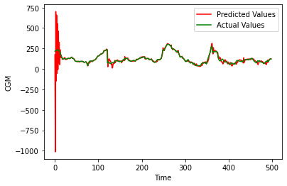
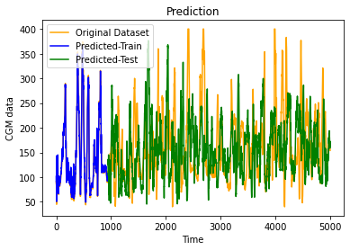
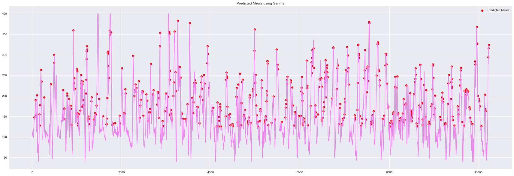

# CGM-Predictor

Forecasting continuous glucose monitor (CGM) readings and detecting meal events from real patient insulin-pump data, using and comparing four modeling approaches: an Unscented Kalman Filter, an LSTM recurrent network, SARIMA, and a Random Forest classifier.

## Problem

People with type 1 diabetes wear a CGM sensor that logs blood glucose every 5 minutes. Predicting near-term glucose values — and recognizing when a meal (a glucose spike driven by carbohydrate intake) is occurring — is a step toward closed-loop insulin delivery ("artificial pancreas") systems. This project explores several classical and deep-learning approaches to both problems on the same dataset and compares how well each does.

## Data

Source data is `InsulinGlucoseData2.mat`, a MATLAB export containing paired CGM and insulin bolus time series (not included in this repo — see below). `Pre-Processing.ipynb` converts it into two CSVs:

| File | Contents |
|---|---|
| `CGMData.csv` / `CGMProcessed.csv` | Timestamped CGM (blood glucose) readings, NaN/Inf rows removed |
| `BolusData.csv` / `BolusProcessed.csv` | Timestamped insulin bolus delivery amounts, NaN/Inf rows removed |
| `kalman_filter.csv` | CGM series annotated with meal / start-of-meal labels, used as ground truth for the Kalman meal-detection experiment |

## Approaches

### 1. Unscented Kalman Filter (`Kalman.ipynb`)
Implements a physiological glucose-insulin state-space model (rate of glucose appearance, insulin concentration, plasma glucose dynamics) and tracks it with an Unscented Kalman Filter (`filterpy`). Uses the filter's residual between predicted and observed CGM to flag meals: a residual above a threshold is classified as a meal, evaluated against the labeled `meal` / `start_of_meal` ground truth via a confusion-matrix-style accuracy check.

### 2. LSTM Recurrent Network (`RNN.ipynb`)
A 4-layer stacked LSTM (50 units/layer, dropout 0.2) forecasts the next CGM value from the previous 72 readings (6 hours of history at 5-minute sampling). Trained on an 80/20 chronological split.

- **Train RMSE:** 6.72
- **Test RMSE:** 6.89
- (dataset mean ≈ 147.7 mg/dL)

### 3. SARIMA (`SARIMA.ipynb`)
Fits a rolling ARIMA(0,1,0) model, re-estimated at each time step (walk-forward validation), to forecast CGM one step ahead. Predicted local maxima above 125 mg/dL are flagged as meal events. Reports MSE/MAE/RMSE against the held-out 20% test split.

### 4. Random Forest Classifier (`Classifier - Random Forest.ipynb`)
Derives meal/no-meal labels from the first-difference of bolus delivery (a difference above a threshold implies a meal-related bolus), then trains a 1000-tree Random Forest on CGM values alone to predict that label. Evaluated with accuracy, a confusion matrix, and a classification report on a 75/25 split.

## Repo structure

```
Pre-Processing.ipynb                # .mat -> CSV conversion, cleaning
Kalman.ipynb                        # UKF glucose tracking + meal detection
RNN.ipynb                           # LSTM CGM forecasting
SARIMA.ipynb                        # Rolling ARIMA CGM forecasting + meal detection
Classifier - Random Forest.ipynb    # RF meal/no-meal classification
CGMData.csv, CGMProcessed.csv       # CGM time series (raw / cleaned)
BolusData.csv, BolusProcessed.csv   # Insulin bolus time series (raw / cleaned)
kalman_filter.csv                   # CGM + meal labels used by Kalman.ipynb
```

## Setup

```bash
python -m venv venv
source venv/bin/activate
pip install -r requirements.txt
jupyter notebook
```

Run `Pre-Processing.ipynb` first if regenerating the CSVs from a `.mat` source file (not required if the processed CSVs in this repo are used as-is); then run any of the four model notebooks independently.

## Results

| Model | Task | Metric | Result |
|---|---|---|---|
| Kalman Filter (UKF) | Meal detection | Accuracy | see `Kalman.ipynb` output |
| LSTM | CGM forecasting | RMSE (test) | 6.89 |
| SARIMA | CGM forecasting / meal detection | RMSE, MAE | see `SARIMA.ipynb` output |
| Random Forest | Meal classification | Accuracy | see `Classifier - Random Forest.ipynb` output |

**UKF glucose tracking** — predicted vs. actual CGM after the initial filter transient settles:



**LSTM forecasting** — predicted CGM (train and test segments) against the original series:



**SARIMA meal detection** — predicted CGM series with flagged meal events (red):



## Notes / limitations

- Meal ground truth in the Random Forest and SARIMA notebooks is heuristically derived from bolus/CGM deltas, not clinician-labeled — treat accuracy numbers as indicative, not diagnostic.
- SARIMA and the Kalman meal-detection loop refit at every timestep, so those notebooks are slow to run end-to-end on the full series.
